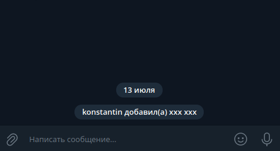
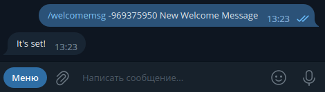
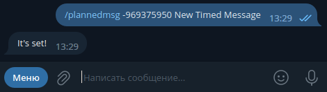
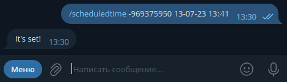
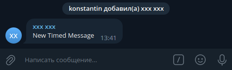
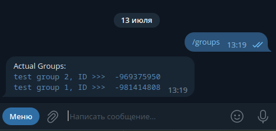
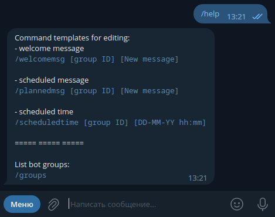
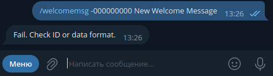
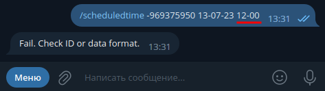

Telegram bot that can welcome new members in group chats and send pre-scheduled messages.  
The bot owner has the ability to edit these messages and the scheduled time for each chat separately.

## How it works

1. Adding a bot to a group chat  
   

2. In private messages to the bot we set:
    - **welcome message** (by default, "Hello!")  
      
    - **scheduled message** (by default, "Hello!")  
      
    - **scheduled message sending time** (not set by default)  
        
      

## Details

- The project is using `java version 17`
- Group ID can be either positive or negative and characters other than numbers are not allowed
- Group ID can be found using `/groups` command from the bot menu  
  
- Follow the data entry format that can be seen using `/help` command from the bot menu  
  
- Fails examples  
    
  

## Deployment

❗ Before deploying, replace your `username` of administrator(s) with your own in `admins` list of `AdminCommand` class
of `command` package.

### Variant 1:

- create Postgresql database  
  You can raise the database using additional software or use docker:

  ```
  docker run --name messagebot-db -p 5432:5432 -e POSTGRES_DB=messagebot_db -e POSTGRES_PASSWORD=your_password -d postgres:15.0
  ```

- in the `application.properties` file, specify the login and password from the database, as well as your bot data.  
  Change the path to the database `db` to `localhost`.  
  You can create an additional file `application-dev.properties` and specify all the data in it.  
  Then you will have to start the application with the `dev` profile like this `--spring.profiles.active=dev`  
  or specify the profile in the launch config in your Intellij IDEA:  
  **Edit Configurations → Spring Boot → MessageBotApplication → Environment → VM options:**  
  `-Dspring.profiles.active=dev`

- execute `mvn clean package`
- run `MessageBotApplication`

### Variant 2:

- execute `mvn clean package`
- to update the image and run containers
  ```
  docker-compose up --build 
  ```
- you can create an additional `docker-compose-dev.yml` file, specify all logins and passwords in it.  
  Then run the command:
  ```
  docker-compose -f docker-compose-dev.yaml up --build
  ```

  To stop and remove containers, press `Ctrl+C` and run `docker-compose down`

## Additional information

### Registering a new bot in Telegram

1. Find the `@BotFather` bot in Telegram
2. Send command `/start`
3. Send command `/newbot`
4. Come up with a name for the bot, for example, **MyTestMessageBot**
5. Come up with a `username` for the bot, for example, **MyTestMessageBot**
6. We get the bot token, for example, `1234567890:AbCdEfGhIjKlMnOpQrStUvWxYz`

## Tech stack

- Spring Boot
- Postgresql
- Telegram API
- Flyway
- Docker
- Mapstruct
- Lombok

## License

This project is Apache License 2.0 - see the [LICENSE](LICENSE) file for details
